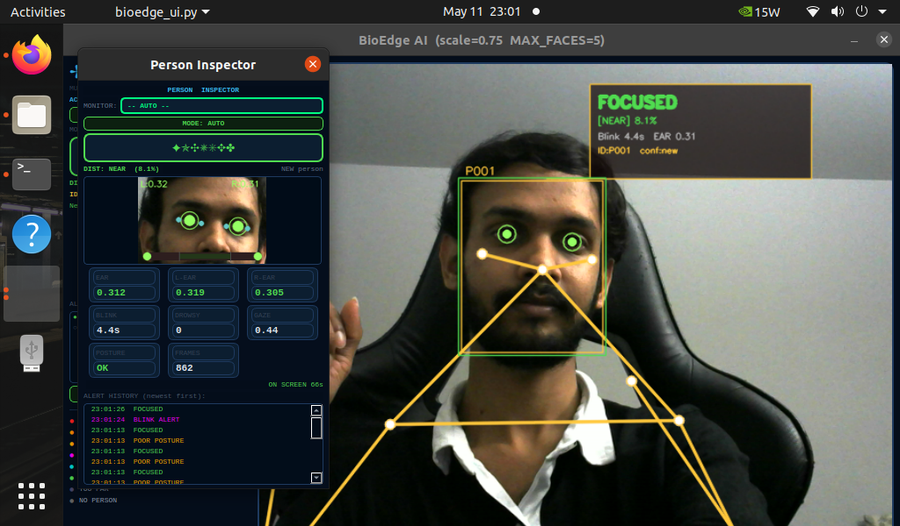
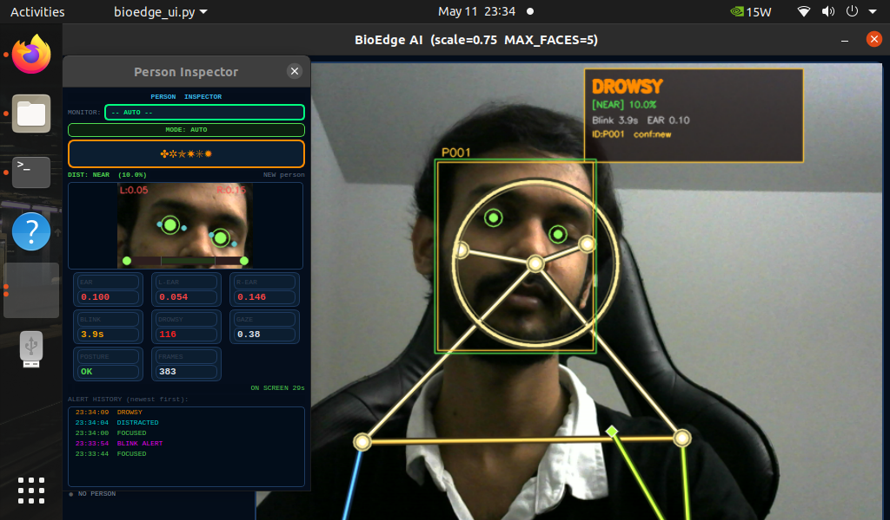
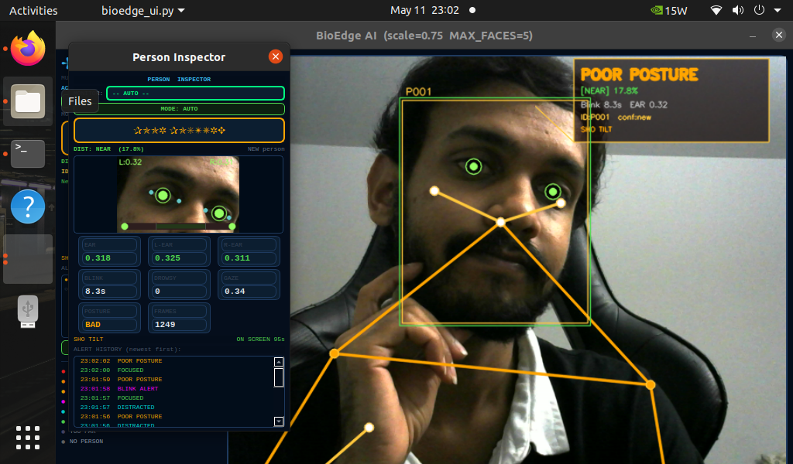
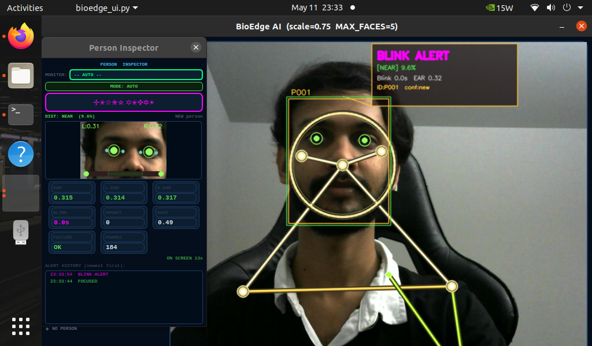
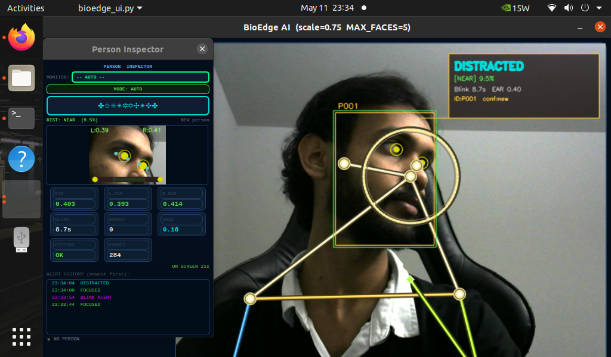
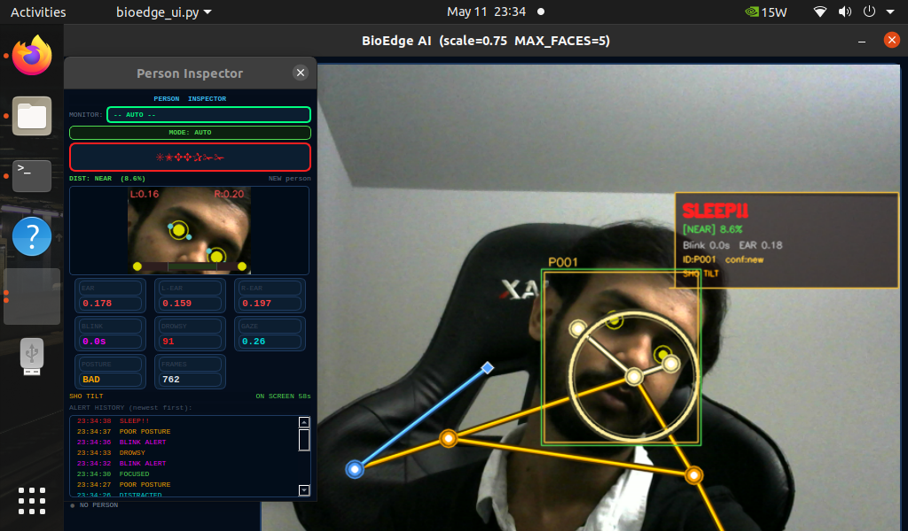
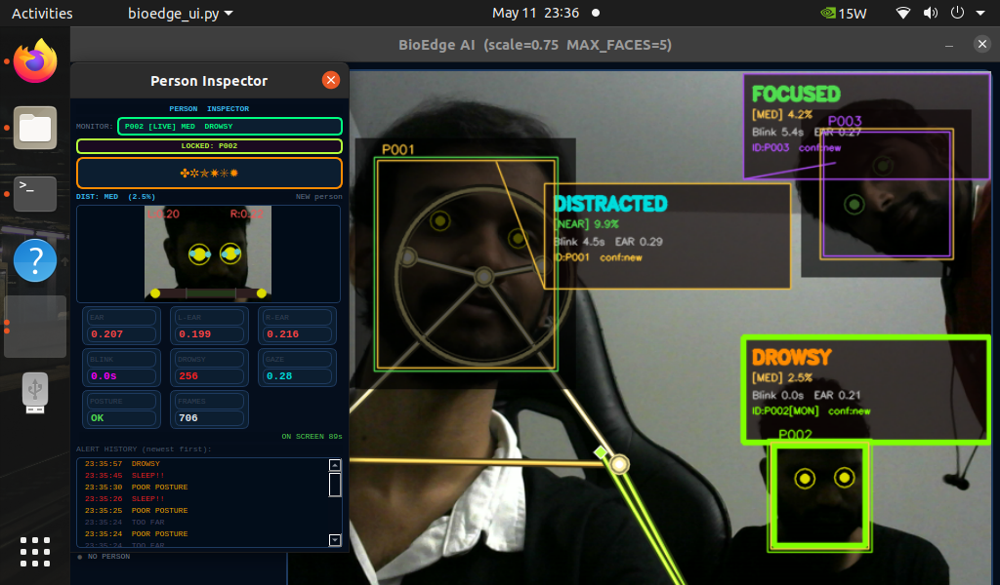
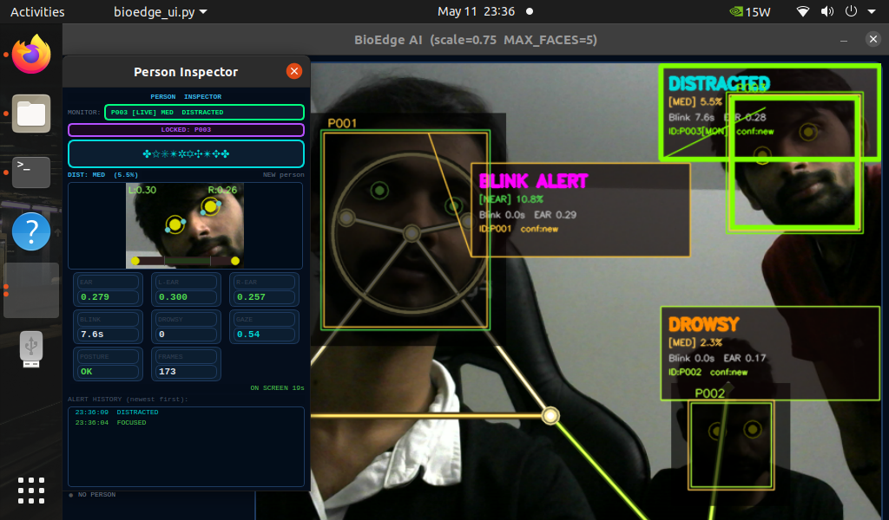

# BioEdge AI — Real-Time Multi-Person Biometric Monitor

<div align="center">



**Master's Project · NVIDIA Jetson Nano · MediaPipe · PyQt5 · Python**

[](https://python.org)
[](https://mediapipe.dev)
[](https://pypi.org/project/PyQt5)
[](https://developer.nvidia.com/embedded/jetson-nano)
[](LICENSE)

</div>

---

## What is BioEdge AI?

BioEdge AI is a production-ready Edge AI system built for the **NVIDIA Jetson Nano**. It monitors up to **5 people simultaneously** in real-time — detecting drowsiness, poor posture, gaze distraction, and missed blinks — with **no cloud dependency**. Everything runs locally on the device.

Each person gets a **persistent unique ID** that survives leaving and returning to frame. A **Person Inspector** dialog lets operators lock monitoring onto any specific individual.

---

## Live Demo — Alert States

All screenshots captured live on the Jetson Nano.

### FOCUSED — Normal State

> All biometric checks pass. EAR normal, posture good, gaze centred, blink countdown active.

---

### DROWSY — Eyes Closed Too Long

> EAR drops below 0.23 for 12+ consecutive frames. Eye crop shows low L/R EAR values (red). Drowsy frame counter shown in Inspector.

---

### POOR POSTURE — Skeleton Geometry Fails

> One or more of 4 skeleton checks fail (spine drift, forward head, shoulder tilt, hip lean). Failing joints highlighted in orange on the exoskeleton.

---

### BLINK ALERT — No Blink in 10 Seconds

> Blink countdown reaches 0. Only a confirmed physical blink (40ms–400ms closure) resets the timer. Single-frame noise is filtered.

---

### DISTRACTED — Eyes Looking Away

> Iris gaze ratio stays outside 0.30–0.75 for 8+ sustained frames. Head-pose corrected — pure head turns do not trigger this alert.

---

### SLEEP!! — Critical Alert (Drowsy + Poor Posture)

> Highest priority alert. Triggered only when both DROWSY and POOR POSTURE conditions are active simultaneously. EAR shown in red, posture BAD.

---

## Person Inspector

<div align="center">

| Standard View | Multi-Person / SLEEP!! State |
|:---:|:---:|
|  |  |

</div>

The **Person Inspector** is a separate left-docked dialog that shows full biometric detail for any selected person:

- **Dropdown selector** — lists all persons ever seen (`[LIVE]` / `[AWAY]`)
- **8 metric cards** — EAR, L-EAR, R-EAR, Blink Timer, Drowsy Frames, Gaze, Posture, Total Frames
- **Re-ID confidence** — shows match % when a person returns to frame
- **Alert history log** — last 30 status changes with `HH:MM:SS` timestamps, colour-coded by alert type
- **AWAY persistence** — last-known values frozen when person leaves; ID reconnects automatically on return

---

## Alert System — Priority Hierarchy

Alerts fire in strict priority order. Only the highest-priority condition is shown at any time.

| Priority | Alert | Condition | Colour |
|:---:|:---|:---|:---:|
| 1 | `SLEEP!!` | Drowsy **AND** Poor Posture simultaneously | 🔴 Red |
| 2 | `DROWSY` | EAR < 0.23 for 12+ consecutive frames | 🟠 Orange |
| 3 | `POOR POSTURE` | Any of 4 skeleton geometry checks fail | 🟡 Amber |
| 4 | `BLINK ALERT` | No confirmed blink for 10 seconds | 🟣 Pink |
| 5 | `DISTRACTED` | Iris off-centre for 8+ sustained frames | 🩵 Cyan |
| 6 | `TOO FAR` | Face area < 0.6% of frame | ⚫ Grey |
| 7 | `FOCUSED` | All conditions clear | 🟢 Green |

---

## Mathematical Foundations

### Eye Aspect Ratio (EAR)

$$EAR = \frac{||p_2 - p_6|| + ||p_3 - p_5||}{2 \cdot ||p_1 - p_4||}$$

Values below **0.23** indicate a closed eye. After **12 consecutive frames** a `DROWSY` alert fires. A **3-frame recovery guard** prevents noise from clearing the counter prematurely.

### Gaze Ratio (Head-Pose Corrected)

$$\text{Gaze Ratio} = \frac{x_{\text{iris}} - x_{\text{outer corner}}}{|x_{\text{inner corner}} - x_{\text{outer corner}}|}$$

Both eye corners move with the head, cancelling rotation. Only actual eye movement triggers the alert. Centre gaze ≈ **0.30–0.75**.

### Posture Detection — 4 Independent Checks

| Check | Landmarks | Threshold |
|:---|:---|:---:|
| Spine drift | Nose X vs mid-hip X | > 0.12 |
| Forward head | Ear Y vs avg shoulder Y | > 0.06 |
| Shoulder tilt | L vs R shoulder Y | > 0.04 |
| Hip tilt | L vs R hip Y | > 0.03 |

### Person Re-ID Signature

14 facial anchor landmarks → **91 pairwise Euclidean distances**, each normalised by inter-ocular distance:

$$d_{ij}^{\text{norm}} = \frac{||p_i - p_j||}{||p_{\text{left eye}} - p_{\text{right eye}}||}$$

Cosine similarity matched against a bank of **6 stored signatures per person**. Threshold: **0.82**. Global greedy assignment ensures no two faces share the same ID in a single frame.

---

## Performance

Tested on **NVIDIA Jetson Nano 4GB** · `model_complexity=0` · 640×480 · no GPU acceleration:

| Scenario | FPS |
|:---|:---:|
| 1 person (Solo) | ~28 FPS |
| 3 persons | ~13 FPS |
| 5 persons (Full Stress Test) | ~7 FPS |

> If FPS drops below 8, set `MAX_FACES = 3` at the top of `bioedge_ui.py`.

---

## Tech Stack

| Component | Technology |
|:---|:---|
| Hardware | NVIDIA Jetson Nano 4GB + USB Webcam |
| Face & Eye AI | MediaPipe FaceMesh — 478 landmarks + iris (468–477) |
| Body AI | MediaPipe Pose — 33 landmarks, `model_complexity=0` |
| Re-ID Engine | Custom — 91-point pairwise distance signature + cosine similarity |
| UI Framework | PyQt5 — QThread for non-blocking video pipeline |
| Video Processing | OpenCV — 640×480, BGR→RGB, frame flip |
| Language | Python 3.8 |

---

## Installation

### Prerequisites

- NVIDIA Jetson Nano running **JetPack 4.6+**
- USB webcam connected
- Python 3.8+

### Install dependencies

```bash
pip3 install opencv-python mediapipe pyqt5 numpy
```

> **Jetson Nano note:** If standard MediaPipe install fails on ARM, use:
> ```bash
> pip3 install mediapipe-rpi4
> ```

### Clone and run

```bash
git clone https://github.com/PUNITHAKASH/BioEdge-Biometric-Monitor.git
cd BioEdge-Biometric-Monitor
python3 bioedge_ui.py
```

---

## Usage

### Basic operation

1. Run `python3 bioedge_ui.py`
2. The **Person Inspector** dialog opens on the left
3. The main window shows the live camera feed with floating HUD overlays
4. The **roster** (sidebar list) shows all persons seen this session

### Selecting a person to monitor

| Method | How |
|:---|:---|
| Dropdown | Pick any person in the Inspector dialog — shows `[LIVE]` / `[AWAY]` |
| Roster click | Click any row in the sidebar person list |
| AUTO button | Release the lock — return to automatic mode (closest face) |

### What happens when locked onto a person

- Sidebar metrics show **only their data**
- Their face gets a **triple-ring glow** on the video feed
- Other persons are **dimmed to 35% brightness**
- If they leave frame, last-known values **freeze** with `[AWAY]` tag
- When they return, re-ID **reconnects automatically** — same ID, history continues

---

## Configuration

All tunable parameters are at the top of `bioedge_ui.py`:

```python
UI_SCALE             = 0.75   # 0.65 for small screens, 1.0 for 1080p
MAX_FACES            = 5      # reduce to 3 for better FPS on Jetson Nano

EAR_THRESH           = 0.23   # eye-closed threshold
DROWSY_FRAME_THRESH  = 12     # frames before DROWSY fires
BLINK_COUNTDOWN      = 10.0   # seconds before BLINK ALERT

FACE_ID_THRESHOLD    = 0.82   # re-ID similarity threshold (higher = stricter)
SIGNATURE_BANK_SIZE  = 6      # signature samples per person
MAX_HISTORY          = 30     # alert events stored per person
```

---

## Project Structure

```
BioEdge-Biometric-Monitor/
├── bioedge_ui.py                  ← Main application — all logic and UI
├── README.md                      ← This file
├── BioEdge_AI_Final.pptx          ← Project presentation slides
└── media/
    ├── demo_focused.png           ← FOCUSED alert screenshot
    ├── demo_drowsy.png            ← DROWSY alert screenshot
    ├── demo_sleep.png             ← SLEEP!! alert screenshot
    ├── demo_posture.png           ← POOR POSTURE alert screenshot
    ├── demo_blink.png             ← BLINK ALERT screenshot
    ├── demo_distracted.png        ← DISTRACTED alert screenshot
    ├── demo_inspector.png         ← Person Inspector dialog
    └── demo_inspector2.png        ← Person Inspector — multi-person view
```

---

## Roadmap

### ✅ Completed
- [x] EAR drowsiness with 3-frame recovery guard
- [x] Head-pose corrected gaze ratio
- [x] 4-check posture engine with exoskeleton overlay
- [x] Blink detection with 40ms–400ms duration gate
- [x] Multi-person tracking up to 5 persons simultaneously
- [x] Persistent person ID — 91-point pairwise face geometry re-ID
- [x] Person Inspector with dropdown selector, 8 metric cards, alert log
- [x] HUD collision avoidance — no overlapping info boxes
- [x] Distance zones NEAR/MED/FAR/TOO FAR with metric suppression
- [x] Monitoring lock — focus on one person, dim others
- [x] UI scaling system for small Jetson Nano monitors
- [x] ~28 FPS solo / ~7 FPS 5-person stress test on Jetson Nano

### 🔜 Future Work
- [ ] GPIO buzzer alert on Jetson Nano for `SLEEP!!` trigger
- [ ] Neural face embedding (MobileNetV2) for stronger re-ID
- [ ] Multi-camera support with cross-camera person handoff
- [ ] Web dashboard (FastAPI + React) for remote monitoring
- [ ] Per-session CSV export for analytics

---

## Known Limitations

- **Pose is single-person only** — MediaPipe Pose doesn't support multi-person. Skeleton applied to closest/selected person only.
- **Re-ID is geometry-based** — not a neural face recogniser. Very similar faces may occasionally share an ID.
- **Far-distance metrics suppressed** — EAR and gaze shown as `N/A` when face is too small for reliable iris detection.
- **Session-only memory** — Alert history and IDs reset on app restart. No disk writes by default.

---

## License

MIT License — free to use, modify, and distribute with attribution.

---

*Built with MediaPipe · OpenCV · PyQt5 · Python · NVIDIA Jetson Nano*
